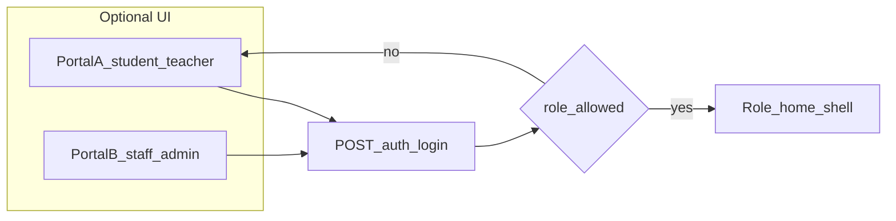

# CIMS API frontend — order and login strategy

## Login: one backend endpoint vs two

Your backend guide defines **one** login for every role:

- `POST /auth/login` with `{ username, password }` returns `access_token`, `refresh_token`, and **`role`** (`admin` | `teacher` | `accountant` | `student`) — see [CIMS_API_IMPLEMENTATION.md](D:\Coding\Flutter\cims_flutter\CIMS_API_IMPLEMENTATION.md) §1.1.

**Recommendation**

- **Keep a single HTTP endpoint** (`/auth/login`) in the client. Do **not** invent a second backend URL unless the server team adds one; the spec does not include `/staff-access` or a separate admin login.
- If you want **two entry experiences** in the app (e.g. “Student / Teacher portal” vs “Staff / Admin portal”), implement that as **two GoRouter routes / two screens** that both call the **same** `AuthApi.login`, then **validate `role` after success**:
  - Portal A: allow `teacher`, `student` (and optionally `accountant` if they should use this portal — clarify product-wise).
  - Portal B: allow `admin`, `accountant`, and `teacher` if teachers should sign in from staff entry too.
  - On mismatch: clear tokens, show a short message, stay on the correct portal.

This matches the backend contract and avoids duplicate auth logic.

**Already in the project**

- Login is wired through Retrofit: [lib/core/network/api/auth_api.dart](D:\Coding\Flutter\cims_flutter\lib\core\network\api\auth_api.dart) → [lib/features/auth/services/auth_service.dart](D:\Coding\Flutter\cims_flutter\lib\features\auth\services\auth_service.dart) → [lib/features/auth/repository/auth_repository.dart](D:\Coding\Flutter\cims_flutter\lib\features\auth\repository\auth_repository.dart).
- Refresh is already handled on 401 via raw `POST` in [lib/core/network/auth_interceptor.dart](D:\Coding\Flutter\cims_flutter\lib\core\network\auth_interceptor.dart) using [lib/core/network/app_config.dart](D:\Coding\Flutter\cims_flutter\lib\core\network\app_config.dart) (`/auth/refresh`).

---

## Suggested step-by-step API order (frontend)

Order follows **dependencies** and **what unlocks the most screens** with the least surface area.

| Step | API area (doc §) | Why this order |
|------|------------------|----------------|
| 1 | **Auth** — complete §1 | Foundation for all calls. You have login; add typed clients or models for **`GET /auth/me`** (and optionally **`POST /auth/change-password`**) next to [auth_api.dart](D:\Coding\Flutter\cims_flutter\lib\core\network\api\auth_api.dart). Refresh can stay as-is in the interceptor or move to Retrofit for consistency. |
| 2 | **Sessions** — §4, especially **`GET /sessions/current`** | Doc explicitly says this is the highest-frequency call; expose a small `SessionRepository` / Riverpod provider used app-wide before feature screens assume a `session_id`. |
| 3 | **Departments + Programs (+ stages) + Subjects** — §2, §3, §7 | Read-heavy reference data for filters and dropdowns on staff, students, timetable, fees. |
| 4 | **Staff + Students** — §5, §6 | Core lists and detail; drives navigation and IDs for later modules. Respect role rules from the doc when wiring queries. |
| 5 | **Timetable** — §8 | Needs `session_id`, `stage`, subjects, staff; **`GET /timetable/weekly`** is the main read for UI. |
| 6 | **Enrollments** — §9 | Needed before results and many attendance flows (who is in which subject). |
| 7 | **Attendance** — §10 | Create session → bulk mark; depends on enrollments / subjects / staff. |
| 8 | **Results** — §11 | Depends on enrollments; grade card is high value for student/teacher. |
| 9 | **Fees** — §12 | Admin/accountant; can parallelize with 7–8 if different owners, but keep after stable student/session IDs. |
| 10 | **Reports (PDF)** — §13 | Same data as above; use `ResponseType.bytes` as in the doc’s Flutter snippet. |

Within each area: implement **list + get-by-id** reads first, then **mutations** (POST/PATCH/DELETE) for the screens that need them.

---

## Practical integration pattern (repeat per module)

- Add a Retrofit `@RestApi()` client under `lib/core/network/api/` (same pattern as [auth_api.dart](D:\Coding\Flutter\cims_flutter\lib\core\network\api\auth_api.dart)), register it on [api_client.dart](D:\Coding\Flutter\cims_flutter\lib\core\network\api_client.dart).
- Add Freezed/json models matching the doc’s JSON (snake_case ↔ Dart via `@JsonKey`).
- Thin **repository** + Riverpod **providers** per feature; keep Dio + interceptor as the single transport layer.
- Map FastAPI errors: `{ "detail": "..." }` — centralize parsing for user-visible messages.

---

## Out of scope for this plan (product decision)

- Whether **`accountant`** uses the “student/teacher” portal or only the “staff” portal — the doc lists accountant as its own role; pick one UX rule and enforce it in the post-login role check.
