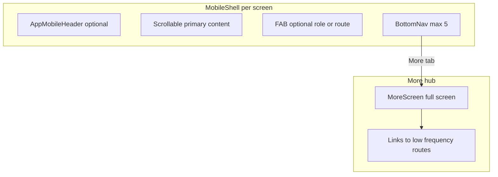

# CIMS Mobile UI/UX implementation plan

## Current baseline (what you already have)

- **Routing and roles**: [lib/core/network/app_router.dart](D:\Coding\Flutter\cims_flutter\lib\core\network\app_router.dart) + [lib/core/session/route_guards.dart](D:\Coding\Flutter\cims_flutter\lib\core\session\route_guards.dart) + session restore in [lib/main.dart](D:\Coding\Flutter\cims_flutter\lib\main.dart).
- **Responsive shell**: [lib/core/widgets/app_scaffold.dart](D:\Coding\Flutter\cims_flutter\lib\core\widgets\app_scaffold.dart) switches desktop (sidebar + [TopBar](D:\Coding\Flutter\cims_flutter\lib\core\widgets\top_bar.dart)) vs mobile (`SafeArea` + scroll body + custom bottom nav). `_openSidebar` + `showModalBottomSheet` already exist for a **full-height sidebar sheet**, but **mobile never shows TopBar or a menu trigger**, so low-frequency routes are hard to reach unless linked from a screen.
- **Design system**: [lib/core/constants/app_colors.dart](D:\Coding\Flutter\cims_flutter\lib\core\constants\app_colors.dart) and [lib/core/theme/app_theme.dart](D:\Coding\Flutter\cims_flutter\lib\core\theme\app_theme.dart) already match “primary blue / accent teal / soft surfaces / gradients” direction.
- **Partial mobile patterns**: [lib/features/students/students_screen.dart](D:\Coding\Flutter\cims_flutter\lib\features\students\students_screen.dart) already uses **cards on phone** and **table on desktop** (`Responsive.isMobile`). [lib/core/utils/modal_helpers.dart](D:\Coding\Flutter\cims_flutter\lib\core\utils\modal_helpers.dart) centralizes responsive modals.

## Gaps vs your strategy (highest impact)

| Strategy item | Gap today |
| --- | --- |
| **5 tabs incl. More** | Admin/student have 4–5 tabs but **no “More”**; teacher has **only 4** tabs in `_teacherNav`. |
| **Teacher: Students in bottom nav** | [route_guards.dart](D:\Coding\Flutter\cims_flutter\lib\core\session\route_guards.dart) **does not allow** `/students` for `teacher`; [StudentsScreen](D:\Coding\Flutter\cims_flutter\lib\features\students\students_screen.dart) hardcodes `role: 'admin'` in `AppScaffold`. |
| **Admin: Finance emphasis** | Bottom nav uses **Results** + **Fees**; your spec places **Finance** in the bar and pushes analytics-style items toward **More**. |
| **Mobile shell: header + FAB** | Mobile scaffold is **body + bottom nav only** (no persistent `AppMobileHeader`, no `floatingActionButton` hook). |
| **Timetable** | [timetable_screen.dart](D:\Coding\Flutter\cims_flutter\lib\features\timetable\timetable_screen.dart) is still oriented around a **weekly grid** mindset; no **day carousel + vertical timeline** branch for `Responsive.isMobile`. |
| **Attendance speed UX** | [attendance_screen.dart](D:\Coding\Flutter\cims_flutter\lib\features\attendance\attendance_screen.dart) has **no swipe / long-press** gestures; need visible fallback actions. |
| **Search overlay** | No dedicated **full-screen search** route/widget; search is inline in some toolbars only. |
| **Nav duplication** | [lib/core/widgets/bottom_nav_bar.dart](D:\Coding\Flutter\cims_flutter\lib\core\widgets\bottom_nav_bar.dart) duplicates role lists but **is not used** by `AppScaffold` (which inlines `_MobileBottomNav`). Risk of drift. |

## Recommended architecture (keep desktop, reshape mobile)

- **Keep** per-screen `AppScaffold` + no `ShellRoute` (matches your prior decision in [.cursor/plans/missing_points_implementation_1a5d5240.plan.md](D:\Coding\Flutter\cims_flutter\.cursor\plans\missing_points_implementation_1a5d5240.plan.md); avoids a risky router-wide hoist until you explicitly want it).
- **Add** a thin **mobile presentation layer**: shared widgets under e.g. `lib/core/widgets/mobile/` (or `lib/features/_mobile/` if you prefer feature-local only later). Your doc’s `feature/mobile/...` tree can be adopted **when** a feature’s mobile UI grows large; start with **shared** primitives to avoid 20 half-empty folders in Phase 1.

## Phase 1 — Navigation and “More” (mock-friendly)

1. **Single source of truth for bottom tabs**  
   - Extract role tab definitions (route, label, icons) from [app_scaffold.dart](D:\Coding\Flutter\cims_flutter\lib\core\widgets\app_scaffold.dart) into one module (e.g. `lib/core/navigation/mobile_bottom_nav.dart`) and **delete or re-home** the unused [bottom_nav_bar.dart](D:\Coding\Flutter\cims_flutter\lib\core\widgets\bottom_nav_bar.dart) to prevent divergence.

2. **Align tabs to your spec** (labels map to existing routes where possible):
   - **Admin**: Dashboard → `/dashboard`, Students → `/students`, Attendance → `/attendance`, **Finance** → `/fees`, **More** → new `/more`. Move **Results** (`/results`) and other admin tools into **More** (and keep sidebar on desktop unchanged).
   - **Teacher**: **Home** → `/dashboard`, **Schedule** → `/timetable`, **Attendance** → `/attendance`, **Students** → `/students`, **More** → `/more`.
   - **Student**: Home → `/dashboard`, Schedule → `/timetable`, Results → `/results`, Fees → `/fees`, **More** → `/more`.

3. **New `MoreScreen`** (full-screen, not a tiny menu): grid or grouped list of links (Reports, Settings, Departments, Programs, …) filtered by **the same allow-list logic** as [route_guards.dart](D:\Coding\Flutter\cims_flutter\lib\core\session\route_guards.dart) so you never show a tile the role cannot open.

4. **Router + guards**  
   - Add `AppRouter.more = '/more'` and a `GoRoute` building `MoreScreen`.  
   - Extend `_teacherPaths` to include `/students` and `/more`.  
   - Ensure **deep link** to a disallowed path still redirects to dashboard (existing pattern).

5. **Teacher students UX**  
   - Fix `StudentsScreen` to pass **actual session role** into `AppScaffold` (same pattern as [admin_dashboard.dart](D:\Coding\Flutter\cims_flutter\lib\features\dashboard\admin_dashboard.dart) using `AppSession.currentRole`).  
   - For Phase 1, use **mock data** with a **read-only or simplified** teacher variant (hide enroll / destructive actions) until APIs exist.

## Phase 1 — Mobile shell components

6. **`AppMobileHeader`** (optional per screen): title, optional subtitle, trailing actions (search opens overlay, avatar opens profile/settings). Wire it inside `AppScaffold._buildMobile` **or** as the first child inside each high-traffic screen—prefer **AppScaffold** if you want consistency with minimal per-screen boilerplate.

7. **`FloatingFab` policy**  
   - Extend `AppScaffold` with optional `Widget? floatingActionButton` / `fabLocation` passed from screens, **or** a small `MobileFab` wrapper.  
   - **Teacher/Admin**: primary quick actions (e.g. mark attendance, add student).  
   - **Student**: default **no FAB**; prefer CTA cards on [student_dashboard_screen.dart](D:\Coding\Flutter\cims_flutter\lib\features\student_portal\student_dashboard_screen.dart) (aligns with your strategy).

8. **Design tokens (incremental)**  
   - Add a small `AppMobileRadii` / typography map (card 16, button/input 12, sheet 20, avatar 14) used by **new** mobile widgets first; widen to existing widgets opportunistically.  
   - Enforce **minimum 16 logical px** on `TextField` / `TextFormField` styles used on mobile (theme `InputDecorationTheme` or targeted `textStyle`) to avoid iOS focus zoom.

9. **`SearchOverlay`**  
   - `showGeneralDialog` or `Navigator.push` with a **opaque full-screen** route: recent searches (mock), suggested students (mock), entry to filters via `showModalBottomSheet(isScrollControlled: true)` per your sheet strategy.

## Phase 1 — Feature UX refactors (mock data)

10. **Timetable (mobile branch)**  
    - In [timetable_screen.dart](D:\Coding\Flutter\cims_flutter\lib\features\timetable\timetable_screen.dart), when `Responsive.isMobile`: **PageView** or horizontal **day chips** + **vertical timeline** list for the selected day; keep existing grid for `!isMobile`.

11. **Attendance**  
    - Wrap each student row with **swipe** (e.g. `DismissDirection` with **confirmDismiss** returning false so row stays, only mutates state — or a small custom horizontal drag) + **long-press** → Late; always show **Present / Absent / Late** icon buttons.  
    - Use bottom sheets for subject/session pickers instead of centered dialogs on mobile (reuse [modal_sheet.dart](D:\Coding\Flutter\cims_flutter\lib\core\widgets\modal_sheet.dart) / [modal_helpers.dart](D:\Coding\Flutter\cims_flutter\lib\core\utils\modal_helpers.dart) patterns).

12. **Student card pattern**  
    - Extract `_studentCard` from students screen into `StudentCard` + optional `onTap` → `showModalBottomSheet` summary → navigate to detail when API exists.

## Phase 2 — Data layer (unchanged UI architecture)

- Swap mock lists for Riverpod `AsyncValue` + repositories per feature, **without** changing the mobile shell or route table. Your existing feature folders (`providers`, `repository`, `services`) already match this direction.

## Testing and quality bar

- **Golden/widget tests** optional for Phase 1; minimum: `flutter analyze` clean on touched files.  
- **Accessibility**: ensure every gesture-only path has visible buttons (your attendance spec).

## Suggested implementation order

1. Nav model + `/more` + guards + teacher `/students` access + `StudentsScreen` role fix.  
2. `AppMobileHeader` + optional FAB in `AppScaffold` mobile.  
3. Timetable mobile timeline.  
4. Attendance gestures + sheet pickers.  
5. Search overlay + token pass on new components.
