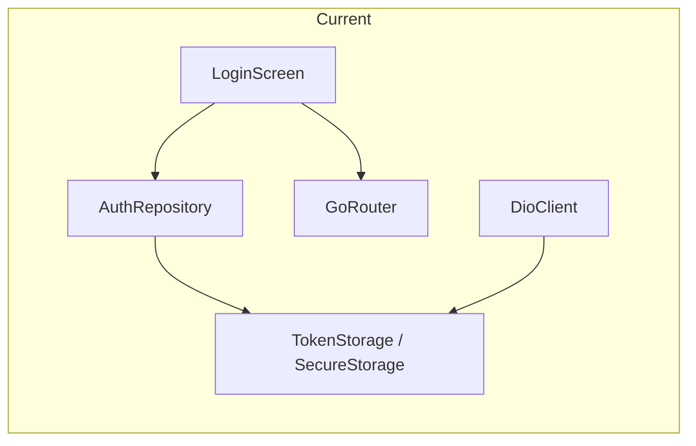
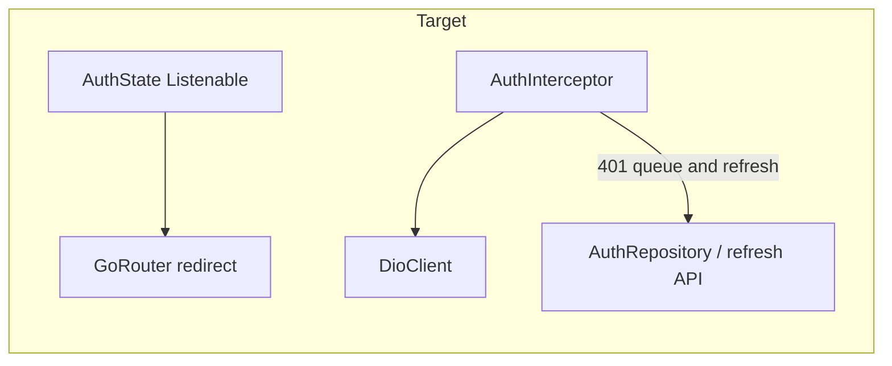

# Implement Missing Points (network, routing, architecture)

## Current state (from codebase)

- **Routing**: [lib/core/network/app_router.dart](D:\Coding\Flutter\cims_flutter\lib\core\network\app_router.dart) defines a flat `GoRoute` tree with no `redirect`, no `refreshListenable`, and no `ShellRoute`. Login only mutates in-memory [lib/core/session/app_session.dart](D:\Coding\Flutter\cims_flutter\lib/core/session/app_session.dart) (`currentRole`, default `'admin'`), so **cold start does not restore role from storage** even though [lib/features/auth/repository/auth_repository.dart](D:\Coding\Flutter\cims_flutter\lib/features/auth/repository/auth_repository.dart) persists `role` in secure storage.
- **Network**: [lib/core/network/dio_client.dart](D:\Coding\Flutter\cims_flutter\lib/core/network/dio_client.dart) attaches a minimal Bearer header via `InterceptorsWrapper`. [lib/core/network/auth_interceptor.dart](D:\Coding\Flutter\cims_flutter\lib/core/network/auth_interceptor.dart) and [lib/core/network/api_client.dart](D:\Coding\Flutter\cims_flutter\lib/core/network/api_client.dart) are **stubs** (“Auto-generated file”). `pretty_dio_logger` is in [pubspec.yaml](D:\Coding\Flutter\cims_flutter\pubspec.yaml) but **not wired**. **Retrofit** is declared but **unused** (no `@RestApi` in `lib/`).
- **Models**: Hand-written `fromJson` (e.g. [lib/features/auth/models/login_response.dart](D:\Coding\Flutter\cims_flutter\lib/features/auth/models/login_response.dart)); **no generated `freezed` files yet** despite `freezed` / `json_serializable` in pubspec.
- **Config duplication**: Real base URL lives in [lib/app_config.dart](D:\Coding\Flutter\cims_flutter\lib/app_config.dart); [lib/core/network/app_config.dart](D:\Coding\Flutter\cims_flutter\lib/core/network/app_config.dart) is a stub. `DioClient` imports the root `app_config.dart` via a fragile relative path.

---

## 1. API and network layer (highest value)

**Consolidate config**

- Make [lib/core/network/app_config.dart](D:\Coding\Flutter\cims_flutter\lib/core/network/app_config.dart) the single source of truth for `baseUrl` (move the value from [lib/app_config.dart](D:\Coding\Flutter\cims_flutter\lib/app_config.dart) or re-export from one place).
- Update [lib/core/network/dio_client.dart](D:\Coding\Flutter\cims_flutter\lib/core/network/dio_client.dart) to import `app_config.dart` from the same `core/network` folder.

**Implement `AuthInterceptor`**

- Replace the stub in [lib/core/network/auth_interceptor.dart](D:\Coding\Flutter\cims_flutter\lib/core/network/auth_interceptor.dart) with a `QueuedInterceptor` (or equivalent pattern) that:
  - Attaches `Authorization: Bearer …` using the same storage as today ([lib/core/services/token_storage.dart](D:\Coding\Flutter\cims_flutter\lib/core/services/token_storage.dart)).
  - On **401** from protected routes: read refresh token from `FlutterSecureStorage`, call a **refresh** endpoint (add `AuthService.refreshToken` next to [lib/features/auth/services/auth_service.dart](D:\Coding\Flutter\cims_flutter\lib/features/auth/services/auth_service.dart)), persist new access token, **retry** the failed request.
  - If refresh fails: clear tokens + secure storage keys used for session, notify auth listenable (below), avoid infinite loops (skip refresh for the refresh/login calls via `RequestOptions.extra` flags).

**Logging**

- In **debug** builds only, add `PrettyDioLogger` (already in pubspec) in `DioClient` after auth-related interceptors (or before, depending on whether you want to log full headers; default to redacting or omitting `Authorization` if you log headers).

**`api_client.dart`**

- Either delete the misleading stub if unused, or turn it into a small **facade** that exposes the configured `Dio` / first Retrofit client (see section 3). Prefer one clear pattern so new code does not import empty files.

---

## 2. Routing: guards and session restoration

**Auth refresh for GoRouter**

- Introduce a small `ChangeNotifier` (e.g. `AuthRouterRefresh` in `lib/core/session/` or next to the router) that `notifyListeners()` on login, logout, and failed refresh. Pass it to `GoRouter(refreshListenable: …)`.

**`redirect` callback**

- **Unauthenticated**: if no access token (async read once and cache in notifier on startup + after login), only allow `/` (login); all other paths → login.
- **Authenticated on login path**: redirect to `AppRouter.dashboard` (or a role-specific home if you split later).
- **Role-based**: maintain sets of paths allowed per role aligned with [lib/core/widgets/app_scaffold.dart](D:\Coding\Flutter\cims_flutter\lib/core/widgets/app_scaffold.dart) nav definitions:
  - **Student** should not open admin-only routes (e.g. departments, programs, sessions, subjects, staff, students, users, reports, and any other admin-only items from the sidebar constants).
  - **Teacher** should not open admin-only management routes; allow dashboard, timetable, attendance, results (match existing teacher nav).
  - **Admin** retains full set.

**Fix teacher vs admin shell role (tied to routing UX)**

- [lib/features/dashboard/admin_dashboard.dart](D:\Coding\Flutter\cims_flutter\lib/features/dashboard/admin_dashboard.dart) currently passes `role: 'admin'` into `AppScaffold`; teachers routed to the same widget will see the wrong menu. Change to use the actual session role (from `AppSession` or, better, from the same auth/session notifier used by the router).

**Startup**

- On app launch (e.g. in `main()` after `WidgetsFlutterBinding.ensureInitialized()` or via a `ProviderScope` + `FutureProvider`), **restore** `access_token` presence and `role` from storage into the auth notifier and `AppSession` so redirects and sidebars are correct before navigation.

**ShellRoute (scoped decision)**

- Today each screen wraps [lib/core/widgets/app_scaffold.dart](D:\Coding\Flutter\cims_flutter\lib/core/widgets/app_scaffold.dart) itself (e.g. [lib/features/dashboard/admin_dashboard.dart](D:\Coding\Flutter\cims_flutter\lib/features/dashboard/admin_dashboard.dart)). Migrating to `ShellRoute` / `StatefulShellRoute` would mean **moving `AppScaffold` up** and converting many `pageBuilder`s to nested `GoRoute`s—high churn, easy to regress responsive behavior.
- **Recommendation**: implement **redirect + refreshListenable** first (satisfies “route guards”). Defer **ShellRoute** to a follow-up milestone unless you want that refactor in this same batch.

---

## 3. Architecture and models (document in code + one exemplar)

**Riverpod layout (already mostly feature-first)**

- Keep **feature-first** structure: `features/<feature>/providers`, `services`, `repository`, `models` (already used by auth, departments, programs). Add a short **comment block** at the top of [lib/features/auth/providers/auth_provider.dart](D:\Coding\Flutter\cims_flutter\lib/features/auth/providers/auth_provider.dart) or a single `lib/core/README_ARCHITECTURE.txt` only if you want zero new markdown files—otherwise skip prose files per your preference.

**Freezed / json_serializable exemplar**

- Convert **auth** DTOs first ([login_request.dart](D:\Coding\Flutter\cims_flutter\lib/features/auth/models/login_request.dart), [login_response.dart](D:\Coding\Flutter\cims_flutter\lib/features/auth/models/login_response.dart)) to `freezed` + `json_serializable`, run `dart run build_runner build --delete-conflicting-outputs`, and update imports. This establishes the pattern for migrating department/program models later without doing the entire codebase at once.

**Retrofit (optional in this pass)**

- After Dio is stable, add **one** `@RestApi` interface for `AuthApi` (login + refresh) in e.g. `lib/core/network/api/auth_api.dart`, generate with `retrofit_generator`, and optionally delegate [AuthService](D:\Coding\Flutter\cims_flutter\lib/features/auth/services/auth_service.dart) to that client—or keep feature `*Service` classes as thin wrappers. This satisfies “Retrofit mentioned in Missing Points” without rewriting every `DepartmentService` method immediately.

---

## 4. Backend contract to confirm during implementation

- **Refresh endpoint URL and JSON shape** (e.g. `/auth/refresh` vs `/auth/token/refresh/`, field name `refresh_token` vs `refresh`). Wire the path and body in `AppConfig` or `AuthService` constants so you can adjust without touching interceptor logic.

---

## 5. Guide alignment (optional, separate from code)

- If you want [CIMS_FLUTTER_GUIDE.md](D:\Coding\Flutter\cims_flutter\CIMS_FLUTTER_GUIDE.md) to match reality, add a subsection describing: Dio stack, interceptor behavior, `GoRouter` location, redirect rules, and the deliberate choice on ShellRoute. This is **documentation only**—say if you want it included in the same PR as the code.
